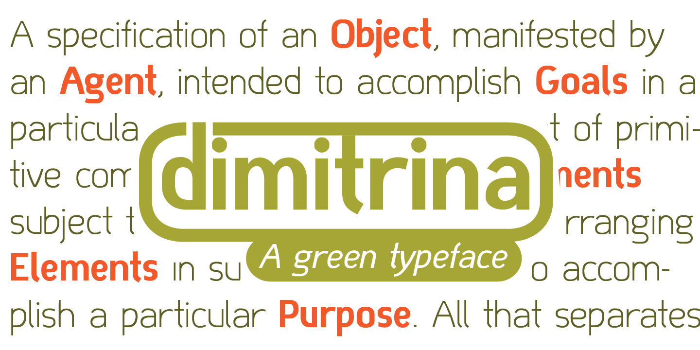
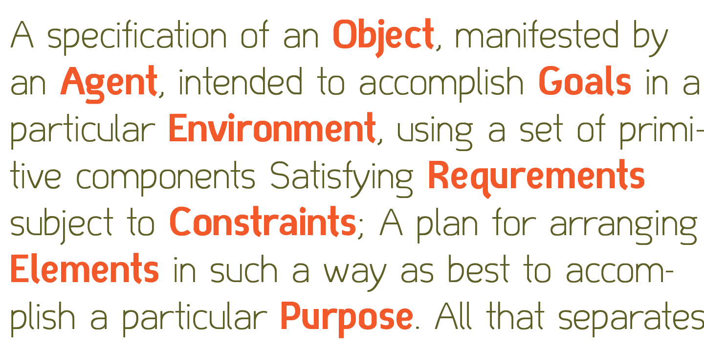

Dimitrina Typeface
===
Dimitrina was created with a simple premise: Can there exist a typeface which features a minimum of sharp angles? And a readable typeface, as well? 

At first the typeface looked more like a script, and some characters ( M G or R, to name a few) still hold traces of a handwritten style which spices the overall taste of Dimitrina.

[Download](otf/)
